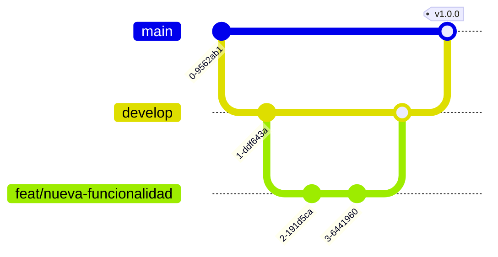

# Guía de Contribución

¡Gracias por tu interés en contribuir a **Sistema de Autenticación por Consola en Java**! Esta guía describe el flujo de trabajo, los estándares de código y el proceso de Pull Requests.

## Tabla de Contenidos

- [Configuración del Entorno](#configuración-del-entorno)
- [Flujo de Trabajo](#flujo-de-trabajo)
- [Estándares de Código](#estándares-de-código)
- [Commits y Mensajes](#commits-y-mensajes)
- [Pull Requests](#pull-requests)
- [Revisión de Código](#revisión-de-código)
- [Testing](#testing)

## Configuración del Entorno

Sigue las instrucciones de instalación del [README](README.md#instalación). Necesitas **Java 17+** y **Maven 3.8+**. Asegúrate de que los tests pasen localmente antes de empezar a trabajar:

```bash
cd auth-console
mvn clean test
```

## Flujo de Trabajo

Usamos un flujo **Git Flow** simplificado.

### Estrategia de Branching

| Rama       | Propósito                                        | Origen    | Destino            |
| ---------- | ------------------------------------------------ | --------- | ------------------ |
| `main`     | Código estable y publicado.                      | —         | —                  |
| `develop`  | Integración de funcionalidades. Pre-release.     | `main`    | `main`             |
| `feat/*`   | Nueva funcionalidad.                             | `develop` | `develop`          |
| `fix/*`    | Corrección de bug no urgente.                    | `develop` | `develop`          |
| `hotfix/*` | Corrección urgente en la rama estable.           | `main`    | `main` y `develop` |
| `docs/*`   | Cambios solo de documentación.                   | `develop` | `develop`          |
| `chore/*`  | Tareas de mantenimiento, tooling, configuración. | `develop` | `develop`          |



### Flujo de una funcionalidad

```bash
# 1. Parte de develop actualizado
git checkout develop
git pull origin develop

# 2. Crea tu rama
git checkout -b feat/nombre-descriptivo

# 3. Trabaja y commitea (ver formato abajo)
git add .
git commit -m "feat: agrega X"

# 4. Sube tu rama y abre un PR hacia develop
git push origin feat/nombre-descriptivo
```

### Nombrado de ramas

- En minúsculas, con prefijo de tipo y descripción en `kebab-case`: `feat/login-google`, `fix/validacion-email`, `docs/actualizar-readme`.

### Políticas de ramas

- `main` se mantiene siempre en verde (CI en verde, tests pasando).
- Mantén tu rama actualizada con `develop` (rebase o merge) antes de abrir el PR.

## Estándares de Código

### Formato

- Indentación y estilo definidos por [`.editorconfig`](.editorconfig): 4 espacios para archivos `.java` y `.xml`.
- Codificación UTF-8, finales de línea LF.

### Nombrado

- Sigue las convenciones idiomáticas de Java: `PascalCase` para clases, `camelCase` para métodos y variables, `UPPER_SNAKE_CASE` para constantes.
- Nombres descriptivos; evita abreviaturas crípticas.

### Comentarios

- El proyecto es didáctico: los comentarios explican el _qué_ y el _por qué_ para apoyar el aprendizaje.
- Documenta las decisiones no obvias y enlaza al ADR correspondiente cuando aplique (ver [`docs/decisions/`](docs/decisions/README.md)).

## Commits y Mensajes

Usamos [Conventional Commits](https://www.conventionalcommits.org/es/v1.0.0/):

```
<tipo>(<ámbito opcional>): <descripción breve en imperativo>

<cuerpo opcional>

<footer opcional: BREAKING CHANGE, Closes #123>
```

Tipos comunes: `feat`, `fix`, `docs`, `style`, `refactor`, `perf`, `test`, `build`, `ci`, `chore`.

Ejemplos:

```
feat(auth): agrega recuperación de contraseña por email
fix(usuario): corrige validación del formato de email
test(autenticador): cubre el caso de contraseña incorrecta
docs: actualiza la guía de instalación
```

## Pull Requests

- Usa la [plantilla de PR](.github/PULL_REQUEST_TEMPLATE.md) (se carga automáticamente).
- Un PR por cambio lógico; mantenlos pequeños y enfocados.
- Vincula los issues relacionados (`Closes #123`).
- Asegúrate de que CI pase (build y tests).

## Revisión de Código

**Como autor:**

- Haz una auto-revisión antes de pedir review.
- Responde a los comentarios y marca las conversaciones resueltas.

**Como revisor:**

- Sé respetuoso y específico; sugiere, no impongas.
- Verifica correctitud, legibilidad, tests y posibles regresiones.

## Testing

- Acompaña cada cambio funcional con tests.
- Ejecuta la suite completa antes de abrir el PR (`mvn test` desde `auth-console/`).
- Sigue las [convenciones de testing](docs/conventions/testing.md).
