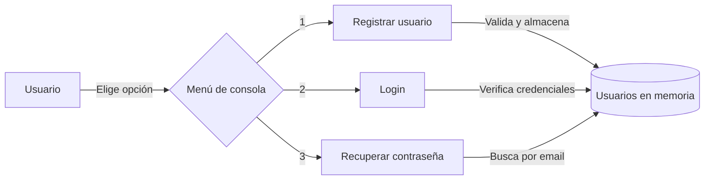

# Sistema de Autenticación por Consola en Java

Aplicación de consola para registro, login y recuperación de contraseña, pensada para enseñar fundamentos de DevOps y buenas prácticas de testing en Java.


## Tabla de Contenidos

- [Descripción](#descripción)
- [Características](#características)
- [Requisitos Previos](#requisitos-previos)
- [Instalación](#instalación)
- [Uso](#uso)
- [Arquitectura](#arquitectura)
- [Stack Tecnológico](#stack-tecnológico)
- [Scripts Disponibles](#scripts-disponibles)
- [Testing](#testing)
- [Cobertura y Reportes](#cobertura-y-reportes)
- [Hook pre-commit (opcional)](#hook-pre-commit-opcional)
- [Contribución](#contribución)
- [Roadmap](#roadmap)
- [Documentación](#documentación)
- [Soporte](#soporte)
- [Versionado](#versionado)
- [Autores](#autores)
- [Licencia](#licencia)
- [Apóyanos](#apóyanos)
- [Agradecimientos](#agradecimientos)

## Descripción

Este proyecto es un sistema sencillo de autenticación de usuarios por consola, pensado para la enseñanza de fundamentos DevOps y buenas prácticas de testing en Java. Permite a los estudiantes experimentar con registro, autenticación, recuperación de contraseña, pruebas unitarias, cobertura de código y automatización con hooks de Git y CI.

Incluye comentarios didácticos en el código y está diseñado para ejecutarse fácilmente en Codespaces, VSCode o cualquier entorno con Maven y Java 17+.

> **Nota**: es un proyecto **didáctico**. No está pensado para producción — ver la
> [Política de Seguridad](SECURITY.md) para las limitaciones conocidas.

### Flujo de Funcionamiento



## Características

- ✅ Registro de usuarios con validación de email y contraseña
- ✅ Autenticación (login) de usuarios
- ✅ Recuperación de contraseña por email
- ✅ Pruebas unitarias con JUnit 5 y Mockito
- ✅ Reportes de pruebas (Surefire) y cobertura de código (JaCoCo)
- ✅ Integración continua con GitHub Actions

## Requisitos Previos

Antes de comenzar, asegúrate de tener instalado:

- **Java (JDK)**: v17 o superior
- **Maven**: v3.8 o superior
- **Git**: para clonar el repositorio

Verifica tus versiones con:

```bash
java -version
mvn -version
```

## Instalación

### 1. Clonar el repositorio

```bash
git clone https://github.com/brayandiazc/java-auth-console.git
cd java-auth-console/auth-console
```

### 2. Compilar el proyecto

```bash
mvn compile
```

Esto compila todo el código fuente Java y genera los `.class` en `target/`.

## Uso

Desde la carpeta `auth-console/`, ejecuta la aplicación de consola:

```bash
mvn exec:java -Dexec.mainClass="com.ejemplo.auth.App"
```

Se mostrará un menú donde podrás registrar usuarios, autenticarte (login) o recuperar contraseñas. Se precarga el usuario `test@mail.com` / `clave123` para facilitar las pruebas.

## Arquitectura

Aplicación de consola con separación de responsabilidades para facilitar el testing: la entrada/salida vive en `App`, la lógica de usuarios en `UsuarioService`, la autenticación en `Autenticador` y el modelo en `Usuario`. Detalle completo en [`docs/architecture/architecture.md`](docs/architecture/architecture.md).

```plaintext
auth-console/
├── pom.xml                         # Configuración de Maven
├── src/
│   ├── main/java/com/ejemplo/auth/
│   │   ├── App.java                # Menú de consola (entrada/salida)
│   │   ├── Usuario.java            # Modelo de usuario
│   │   ├── UsuarioService.java     # Registro y búsqueda de usuarios
│   │   └── Autenticador.java       # Verificación de credenciales
│   └── test/java/com/ejemplo/auth/ # Pruebas unitarias (JUnit 5 + Mockito)
└── target/                         # Artefactos generados por Maven
```

## Stack Tecnológico

Java 17, Maven, JUnit 5, Mockito, JaCoCo y GitHub Actions. Inventario completo con versiones y justificación en [`docs/architecture/stack.md`](docs/architecture/stack.md).

## Scripts Disponibles

Ejecuta estos comandos desde la carpeta `auth-console/`:

```bash
mvn compile                                              # Compilar
mvn exec:java -Dexec.mainClass="com.ejemplo.auth.App"    # Ejecutar la app
mvn test                                                 # Ejecutar los tests
mvn clean test                                           # Limpiar y testear
```

## Testing

### Ejecutar todos los tests

```bash
mvn test
```

### Ejecutar una clase o método específico

```bash
mvn -Dtest=AutenticadorTest test
mvn -Dtest=AutenticadorTest#autenticaUsuarioCorrecto test
mvn -Dtest=AutenticadorTest,RecuperarContrasenaTest test
```

Convenciones de testing en [`docs/conventions/testing.md`](docs/conventions/testing.md).

## Cobertura y Reportes

### Reporte HTML de pruebas (Surefire)

```bash
mvn test
mvn surefire-report:report
# Abre: target/site/surefire-report.html
```

### Reporte de cobertura (JaCoCo)

```bash
mvn test
# Abre: target/site/jacoco/index.html
```

## Hook pre-commit (opcional)

Puedes validar los tests antes de cada commit con un hook local. Los hooks **no** se comparten por Git; cada persona lo instala en su máquina.

```bash
# Crea .git/hooks/pre-commit con este contenido y dale permisos de ejecución:
#!/bin/bash
cd auth-console
echo "Ejecutando tests antes del commit..."
mvn -q test
if [ $? -ne 0 ]; then
    echo "❌ Los tests fallaron. Commit cancelado."
    exit 1
fi
echo "✅ Todos los tests pasaron."
```

```bash
chmod +x .git/hooks/pre-commit
```

Más detalles en [`docs/conventions/quality-tooling.md`](docs/conventions/quality-tooling.md).

## Contribución

Lee la [Guía de Contribución](CONTRIBUTING.md) para conocer el flujo de trabajo (Git Flow), el formato de commits (Conventional Commits) y el proceso de Pull Requests. Respeta también el [Código de Conducta](CODE_OF_CONDUCT.md).

## Roadmap

Visión y próximos pasos en [`docs/product/roadmap.md`](docs/product/roadmap.md).

## Documentación

Toda la documentación vive en [`docs/`](docs/README.md):

| Documento                                                                | Responde a                       |
| ------------------------------------------------------------------------ | -------------------------------- |
| [`docs/architecture/architecture.md`](docs/architecture/architecture.md) | ¿Cómo está construido?           |
| [`docs/architecture/stack.md`](docs/architecture/stack.md)               | ¿Con qué tecnologías?            |
| [`docs/architecture/auth.md`](docs/architecture/auth.md)                 | ¿Cómo se autentica?              |
| [`docs/conventions/`](docs/conventions/README.md)                        | ¿Cómo trabajamos en este repo?   |
| [`docs/decisions/`](docs/decisions/README.md)                            | ¿Por qué tomamos cada decisión?  |
| [`docs/product/roadmap.md`](docs/product/roadmap.md)                     | ¿Hacia dónde va?                 |
| [`docs/glossary.md`](docs/glossary.md)                                   | ¿Qué significa cada término?     |

## Soporte

¿Problemas o sugerencias? Abre un issue en [el repositorio](https://github.com/brayandiazc/java-auth-console/issues) o escribe a <brayandiazc@gmail.com>.

## Versionado

Usamos [Git](https://git-scm.com) para el control de versiones y seguimos [Semantic Versioning](https://semver.org/). Consulta las [etiquetas](https://github.com/brayandiazc/java-auth-console/tags) para ver las versiones disponibles y el [CHANGELOG](CHANGELOG.md).

## Autores

- **Brayan Diaz C** — _Trabajo inicial_ — [@brayandiazc](https://github.com/brayandiazc)

Consulta también la lista de [contribuidores](https://github.com/brayandiazc/java-auth-console/contributors).

## Licencia

Este proyecto está bajo la licencia [MIT](LICENSE).

## Apóyanos

Si este proyecto te resulta útil y quieres apoyar su desarrollo:

- [GitHub Sponsors](https://github.com/sponsors/brayandiazc)

## Agradecimientos

Gracias a quienes contribuyen a este proyecto. Si encuentras valor en él, puedes:

- Compartir el proyecto 📤
- Invitar un café ☕
- Abrir un issue o PR 🙌
- Dejar tu agradecimiento con un comentario 💬

---

⌨️ con ❤️ por [@brayandiazc](https://github.com/brayandiazc)
