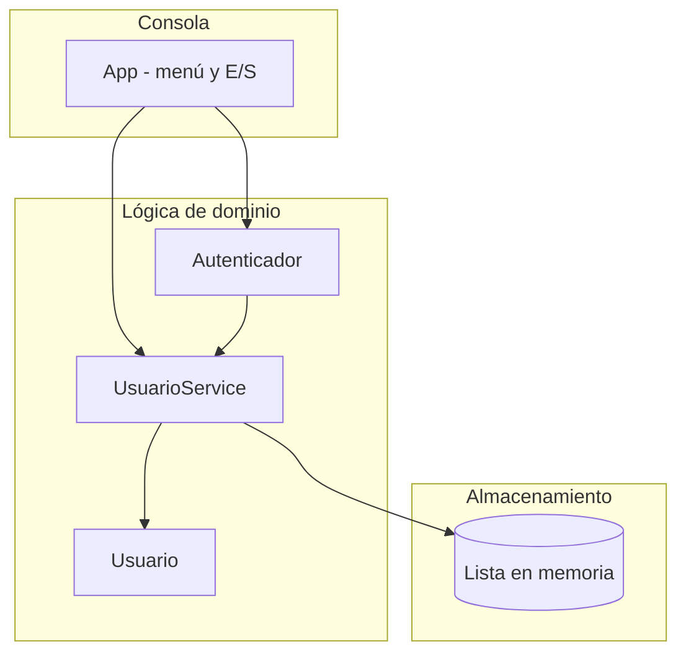
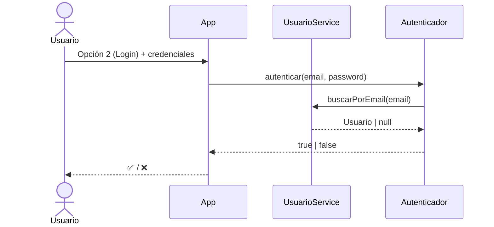

# Sistema de Autenticación por Consola en Java — Arquitectura

> Vista de alto nivel de cómo está construido el sistema y cómo se reparten las
> responsabilidades. Para el stack real (versiones, librerías) ver
> [`stack.md`](stack.md).
>
> **Última actualización**: 2026-07-02

## Diagrama

## Componentes

| Componente       | Responsabilidad                                                        | Tecnología |
| ---------------- | --------------------------------------------------------------------- | ---------- |
| `App`            | Menú de consola: lee la opción y los datos, muestra resultados.       | Java (Scanner) |
| `UsuarioService` | Registra usuarios, valida email/contraseña y busca por email.         | Java       |
| `Autenticador`   | Verifica credenciales; recibe `UsuarioService` por inyección.         | Java       |
| `Usuario`        | Modelo inmutable con email y contraseña.                              | Java       |

## Decisiones clave

| Decisión                                             | Razón                                                        |
| ---------------------------------------------------- | ----------------------------------------------------------- |
| Separar `Autenticador` de `UsuarioService`           | Permite testear la autenticación aislada y mockear la dependencia. |
| Almacenamiento en memoria (`ArrayList`)              | Simplicidad didáctica; el foco es testing y DevOps, no persistencia. |
| Inyección de dependencias por constructor            | Facilita el uso de mocks en los tests con Mockito.          |

> El detalle y las alternativas de cada decisión relevante se registran como
> ADRs en [`../decisions/`](../decisions/README.md).

## Reglas no negociables

- La lógica de dominio (`UsuarioService`, `Autenticador`) no imprime ni lee de consola: la E/S vive solo en `App`. Esto la mantiene testeable.
- Todo cambio funcional se acompaña de tests (ver [`../conventions/testing.md`](../conventions/testing.md)).

## Flujos principales

## Referencias

- [`stack.md`](stack.md) — stack tecnológico y versiones.
- [`auth.md`](auth.md) — autenticación y recuperación de cuenta.
- [`../conventions/`](../conventions/README.md) — convenciones de trabajo.
