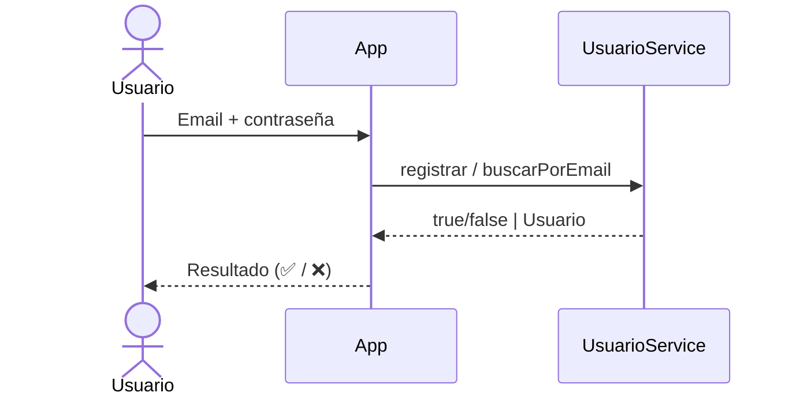

# Autenticación y Recuperación de Cuenta

> Cómo se registran, autentican y recuperan la cuenta los usuarios en este
> proyecto. Para las reglas transversales (y cómo debería hacerse en producción)
> ver [`../conventions/authentication.md`](../conventions/authentication.md).
>
> **Última actualización**: 2026-07-02

> ⚠️ **Proyecto didáctico**: las contraseñas se guardan en memoria **sin hashear**
> y la recuperación las muestra en texto plano. Es intencional para simplificar el
> aprendizaje; **no** es un patrón válido para producción (ver [SECURITY.md](../../SECURITY.md)).

## Visión general

- **Método de autenticación**: comparación directa de email + contraseña en memoria.
- **Almacenamiento de credenciales**: `ArrayList<Usuario>` en `UsuarioService` (volátil).
- **Hashing de contraseñas**: ninguno (limitación didáctica conocida).

## Modelo de identidad

| Concepto | Descripción                                                        |
| -------- | ------------------------------------------------------------------ |
| Usuario  | Entidad inmutable con `email` y `password` (`Usuario.java`).       |
| Sesión   | No existe: la app procesa una sola operación por ejecución.        |
| Roles    | No aplica: no hay autorización por roles.                          |

## Reglas de validación (registro)

Implementadas en `UsuarioService.registrar`:

- El email no puede ser nulo y debe cumplir `^\S+@\S+\.\S+$`.
- La contraseña debe tener al menos 6 caracteres.
- El email no puede estar ya registrado (sin duplicados).

## Flujo de registro / login

## Recuperación de cuenta

- Opción 3 del menú: se ingresa el email, se busca el usuario y —en este ejercicio— se muestra la contraseña almacenada.
- En un sistema real esto se sustituiría por un flujo de _reset_ con token de un solo uso y expiración (ver la convención de autenticación).

## Consideraciones de seguridad

Ver [SECURITY.md](../../SECURITY.md) para la política completa y las limitaciones conocidas.
